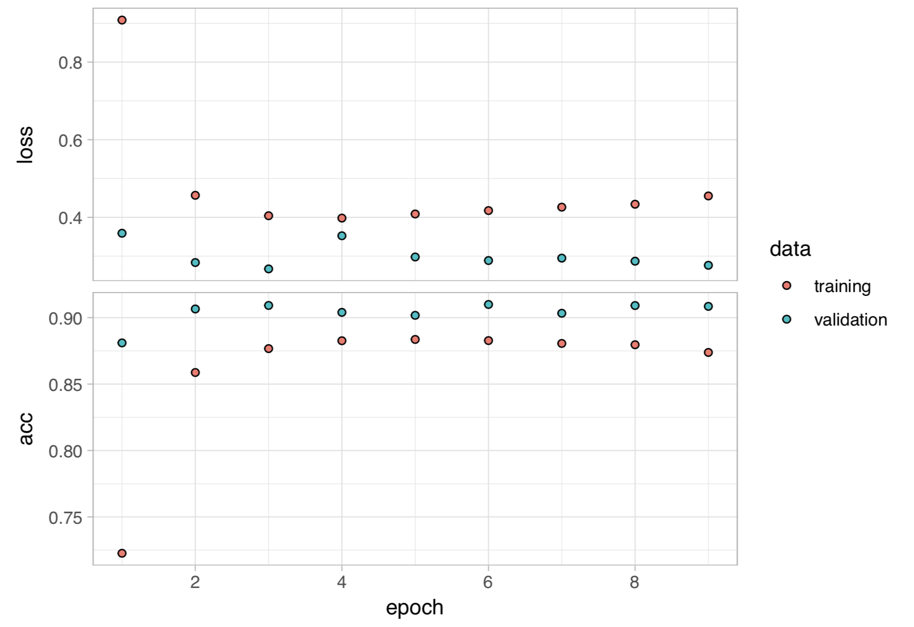
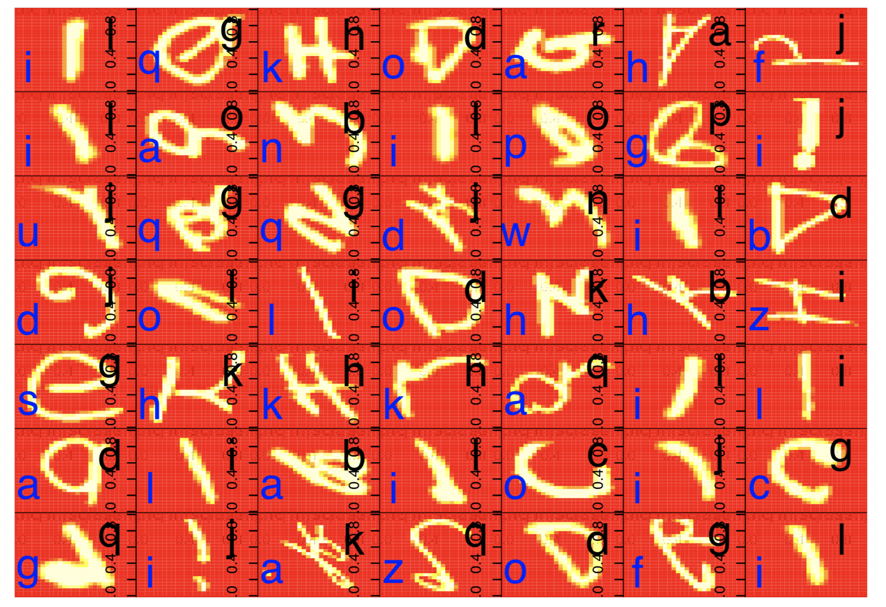

```{r}
library(tidyverse)
library(keras)
library(glmnet)
library(tidyr)
library(ggplot2)
library(readr)
library(tensorflow)
```

## Problem 1: MNIST
Import dataset.
```{r}
mnist <- dataset_mnist()

x_train <- mnist$train$x
y_train <- mnist$train$y
x_test <- mnist$test$x
y_test <- mnist$test$y
x_train <- array_reshape(x_train, c(60000, 28^2))
x_test <- array_reshape(x_test, c(10000, 28^2))
X_train <- mnist$train$x
X_valid <- mnist$test$x
Y_train <- mnist$train$y
Y_valid <- mnist$test$y
```

First, train the model without extracted features.
```{r}
x_train <- as.matrix(x_train)
x_test <- as.matrix(x_test)
y_train <- factor(y_train)
set.seed(1995)
s <- sample(seq_along(y_train), 1000)

fit <- cv.glmnet(x_train[s, ], y_train[s], family = "multinomial")

# in-sample test
preds.in1 <- predict(fit$glmnet.fit, x_train[s, ], s = fit$lambda.min, type = "class")
t11 <- table(as.vector(preds.in1), y_train[s])
sum(diag(t11)) / sum(t11) ## prediction accuracy on training dataset, 0.996

# out-of-sample test
preds.out1 <- predict(fit$glmnet.fit, x_test, s = fit$lambda.min, type = "class")
t21 <- table(as.vector(preds.out1), y_test)
sum(diag(t21)) / sum(t21) ## prediction accuracy on testing dataset, 0.8535
```

If we just used 784 pixels data for each image, then we got the prediction accuracy on training dataset: 99.6%, on testing dataset: 85.35%.

Some Visualizations of data that can help us extract features.
```{r}
mnist_train <- cbind(V1 = y_train, x= x_train)
colnames(mnist_train)[1] <- 'V1'
mnist_tibble <- as_tibble(mnist_train)

## Visualization of digits
pixels_gathered <- mnist_tibble %>%
  head(10000) %>%
  rename(label = V1) %>%
  mutate(instance = row_number()) %>%
  gather(pixel, value, -label, -instance) %>%
  tidyr::extract(pixel, "pixel", "(\\d+)", convert = TRUE) %>%
  mutate(pixel = pixel - 2,
         x = pixel %% 28,
         y = 28 - pixel %/% 28)

theme_set(theme_light())

pixels_gathered %>%
  filter(instance <= 12) %>%
  ggplot(aes(x, y, fill = value)) +
  geom_tile() +
  facet_wrap(~ instance + label)

## Exploring pixel data, most pixel values are either black or white
ggplot(pixels_gathered, aes(value)) +
  geom_histogram()

## Find the mean value for each position within each label
pixel_summary <- pixels_gathered %>%
  group_by(x, y, label) %>%
  summarize(mean_value = mean(value)) %>%
  ungroup()

pixel_summary %>%
  ggplot(aes(x, y, fill = mean_value)) +
  geom_tile() +
  scale_fill_gradient2(low = "white", high = "black", mid = "gray", midpoint = 127.5) +
  facet_wrap(~ label, nrow = 2) +
  labs(title = "Average value of each pixel in 10 MNIST digits",
       fill = "Average value") +
  theme_void()

## Euclidean distance (square root of the sum of squares) of each image to its label’s centroid.Explore atypical cases: it could help us understand why the method fails and help us choose a method and engineer features.

pixels_joined <- pixels_gathered %>%
  inner_join(pixel_summary, by = c("label", "x", "y"))

image_distances <- pixels_joined %>%
  group_by(label, instance) %>%
  summarize(euclidean_distance = sqrt(mean((value - mean_value) ^ 2)))
## which digits have more variability on average?
ggplot(image_distances, aes(factor(label), euclidean_distance)) +
  geom_boxplot() +
  labs(x = "Digit",
       y = "Euclidean distance to the digit centroid")
```

Then, we extracted some features based on previous explorations. The mean value of each image differs across 10 digits (called centroids). Also, different people have various habits to write numbers. Variability is important as well. I will calculate the Euclidean distance that measures the distance for each pixel and centroids for each image.

```{r}
centroids <- apply(x_train, 1, mean)
x_train <- as.data.frame(x_train)
x_train$centroids <- centroids

distance <- apply(x_train, 1, function(x){
  cent <- as_vector(x[length(x)])
  ee<- (x[1: (length(x) - 1)] - cent)^2
  ee <- as_vector(ee)
  sqrt(mean(ee))
})
x_train$distance <- distance


centroids2 <- apply(x_test, 1, mean)
x_test <- as.data.frame(x_test)
x_test$centroids <- centroids2

distance2 <- apply(x_test, 1, function(x){
  cent <- as_vector(x[length(x)])
  ee<- (x[1: (length(x) - 1)] - cent)^2
  ee <- as_vector(ee)
  sqrt(mean(ee))
})
x_test$distance <- distance2


## train the model
x_train <- as.matrix(x_train)
x_test <- as.matrix(x_test)
y_train <- factor(y_train)

## lasso regression
fit2 <- cv.glmnet(x_train[s, ], y_train[s], family = "multinomial")

# in-sample test
preds.in <- predict(fit2$glmnet.fit, x_train[s, ], s = fit2$lambda.min, type = "class")
t1 <- table(as.vector(preds.in), y_train[s])
sum(diag(t1)) / sum(t1) ## prediction accuracy on training dataset, 0.995

# out-of-sample test
preds.out <- predict(fit2$glmnet.fit, x_test, s = fit2$lambda.min, type = "class")
t2 <- table(as.vector(preds.out), y_test)
sum(diag(t2)) / sum(t2) ## prediction accuracy on testing dataset, 0.8545

# misclassification digits
iset <- sample(which(as.numeric(preds.out) != y_test),7*7)
par(mar=c(0,0,0,0))
par(mfrow=c(7,7))
for (j in iset) {
  image(mnist$test$x[j,,], sub = "Black: True number; Blue: Predicted number",
        main = "Some of the misclassified digits")
  text(0.8,0.7, y_test[j], cex=3, col="black")
  text(0.1,0.3, preds.out[j], cex=3, col="blue")
}
```

After adding two new features to each image, we got the prediction accuracy on training dataset: 99.5%, on testing dataset: 85.45%. Compared to the value 99.6% and 85.35%, out-of-sample prediction accuracy increases by 0.1% and in-sample prediction accuracy decreases by 0.1%. This demonstrates that overfitting problem was ameliorated and out-of-sample prediction accuracy was elevated by extracting some new features for modeling. By plotting those misclassified digits on testing dataset, I found that those digits were misclassfied due to the rotation of the number. Therefore, if there is any approach that cooperates the rotation feature in the training dataset, then the prediction accuracy would significantly increase. 

Reference: 

http://varianceexplained.org/r/digit-eda/

http://apapiu.github.io/2016-01-02-minst/

Finally, we used CNN to train the model.
```{r, eval=FALSE}
X_train <- array_reshape(X_train, dim = c(nrow(X_train), 28, 28, 1))
X_valid <- array_reshape(X_valid, dim = c(nrow(X_valid), 28, 28, 1))
Y_train <- to_categorical(Y_train, 10L)
Y_valid <- to_categorical(Y_valid, 10L)
# define the model
model <- keras_model_sequential()

model %>% 
layer_conv_2d(filters = 32, kernel_size = c(2,2),
input_shape = c(28, 28, 1),
                padding = "same") %>%
layer_activation(activation = "relu") %>%
layer_max_pooling_2d(pool_size = c(2, 2)) %>%
layer_dropout(rate = 0.5) %>%
layer_flatten() %>%
layer_dense(units = 128) %>%
layer_activation(activation = "relu") %>%
layer_dropout(rate = 0.5) %>%
layer_dense(units = 128) %>%
layer_activation(activation = "relu") %>%
layer_dropout(rate = 0.5) %>%
layer_dense(units = 10) %>%
layer_activation(activation = "softmax")

# Compile model
model %>% compile(loss = 'categorical_crossentropy',
                  optimizer = optimizer_rmsprop(),
                  metrics = c('accuracy'))
set.seed(13)
history <- model %>%
  fit(X_train, Y_train, epochs = 10,
      validation_data = list(X_valid, Y_valid))

predict.train <- predict_classes(model, X_train)
predict.test <- predict_classes(model, X_valid)
```


```{r}
data(history1)
data(predict_train_1)
data(predict_test_1)

plot(history)
# Prediction 
print(paste0("Prediction accuracy on training dataset is ", mean(predict.train == y_train)))
print(paste0("Prediction accuracy on testing dataset is ", mean(predict.test == y_test)))
```

From the output above, the prediction accuracy on training dataset is lower than lasso regression but the accuracy on testing dataset is higher, 85.85% compared to 85.35%. Also, the problem of overfitting was avoided in the CNN method as the accuracy on traning dataset was not high above the accuracy on testing dataset.

## Problem 2:
```{r, eval=FALSE}
emnist_train <- data(emnist_train)
emnist_test <- data(emnist_test)

x_train <- emnist_train[, 2:785] # too large to reshape !! 
y_train <- as_vector(emnist_train[, 1]) -1
x_test <- emnist_test[, 2:785]
y_test <- as_vector(emnist_test[, 1]) - 1

x_train <- (x_train / 255) # keep only 0-1. Lose gray-scale information
x_test <- (x_test / 255)


train_y <- to_categorical(y_train,26L)
test_y <- to_categorical(y_test,26L)


X_train <- x_train
X_train <- as.matrix(X_train)
X_train <- array_reshape(X_train, dim = c(nrow(x_train), 28, 28, 1))
Y_train <- train_y
X_valid <- as.matrix(x_test)
X_valid <- array_reshape(X_valid, dim = c(nrow(x_test), 28, 28, 1))
Y_valid <- test_y


# image(X_train[1,,,])


model <- keras_model_sequential()

# Define model
model %>%
  layer_conv_2d(filters = 32, kernel_size = c(2,2),
                input_shape = c(28, 28, 1),
                padding = "same") %>%
  layer_activation(activation = "relu") %>%
  layer_conv_2d(filters = 32, kernel_size = c(2,2),
                padding = "same") %>%
  layer_activation(activation = "relu") %>%
  layer_max_pooling_2d(pool_size = c(2, 2)) %>%
  layer_dropout(rate = 0.25) %>%
  layer_conv_2d(filters = 32, kernel_size = c(2,2),
                padding = "same") %>%
  layer_activation(activation = "relu") %>%
  layer_conv_2d(filters = 32, kernel_size = c(2,2),
                padding = "same") %>%
  layer_activation(activation = "relu") %>%
  layer_max_pooling_2d(pool_size = c(2, 2)) %>%
  layer_dropout(rate = 0.5) %>%
  layer_flatten() %>%
  layer_dense(units = 128) %>%
  layer_activation(activation = "relu") %>%
  layer_dense(units = 128) %>%
  layer_activation(activation = "relu") %>%
  layer_dropout(rate = 0.5) %>%
  layer_dense(units = 26) %>%
  layer_activation(activation = "softmax")

# Compile model
model %>% compile(loss = 'categorical_crossentropy',
                  optimizer = optimizer_rmsprop(),
                  metrics = c('accuracy'))
set.seed(13)
history <- model %>%
  fit(X_train, Y_train, epochs = 9,
      validation_data = list(X_valid, Y_valid))

predict.train <- predict_classes(model, X_train)
predict.test <- predict_classes(model, X_valid)

# misclassification letters
iset2 <- sample(which(as.numeric(predict.test) != y_test),7*7)
par(mar=c(0,0,0,0))
par(mfrow=c(7,7))
for (j in iset2) {
  image(X_valid[j,,,], sub = "Black: True letter; Blue: Predicted letter",
        main = "Some of the misclassified digits")
  text(0.8,0.7, letters[y_test[j]+1], cex=3, col="black")
  text(0.1,0.3, letters[predict.test[j]+1], cex=3, col="blue")
}
```

As training model is very time-consuming, I saved the trained model and predicted values. I reported the prediction accuracy here without retraining the model on travisCI.





Prediction
```{r}
data(predict_train)
data(predict_test)
data(y_train)
data(y_test)
data(history)

# plot(history)
print(paste0("Prediction accuracy on training dataset is ", mean(predict.train == y_train)))
print(paste0("Prediction accuracy on testing dataset is ", mean(predict.test == y_test)))

```





By adjusting the drop-out rate from 0.5 to 0.25, the prediction accuracy on training test and testing dataset was both improved a little. The original prediction accuracy in the text book are 0.9166667 (training) and 0.9039263 (testing). Now, the prediction accuracy are 0.924661313753533 (training) and 0.908507331576458 (testing). Since both of them have already been greater than 0.9, it is difficult to significantly improve the performance. Also, by plotting misclassified letters, we can observe that most misclassified letters were rotated or mirrored, which may cause difficulty for CNN to classify them.


## Problem 3: Write a function that uses mean absolute deviance.

casl_nn_make_weights function
```{r}
# Create list of weights to describe a dense neural network.
#
# Args:
#     sizes: A vector giving the size of each layer, including
#
#
# Returns:
#     A list containing initialized weights and biases.
casl_nn_make_weights <- function(sizes){
  L <- length(sizes) - 1L
  weights <- vector("list", L)
  for (j in seq_len(L)){
    w <- matrix(rnorm(sizes[j] * sizes[j + 1L]),
            ncol = sizes[j],
            nrow = sizes[j + 1L])
    weights[[j]] <- list(w=w,
                     b=rnorm(sizes[j + 1L]))
  }
  weights
}
weight <- casl_nn_make_weights(c(1, 25, 1))
```

casl_util_ReLu function
```{r}
# Apply a rectified linear unit (ReLU) to a vector/matrix.
#
# Args:
#     v: A numeric vector or matrix.
#
# Returns:
#     The original input with negative values truncated to zero.
casl_util_ReLU <- function(v){
v[v < 0] <- 0
v }
```

casl_util_ReLU_p function
```{r}
# Apply derivative of the rectified linear unit (ReLU).
#
# Args:
#     v: A numeric vector or matrix.
#
# Returns:
#     Sets positive values to 1 and negative values to zero.
casl_util_ReLU_p <- function(v){
  p <- v * 0
  p[v > 0] <- 1
  p
}
```

casl_util_mse_p function
```{r}
# Derivative of the mean squared error (MSE) function.
#
# Args:
#     y: A numeric vector of responses.
#     a: A numeric vector of predicted responses.
#
# Returns:
#     Returned current derivative the MSE function.
casl_util_mse_p <- function(y, a){
  dev <- c()
  for(i in seq_along(a)){
    if(a[i] >= y[i]) dev[i] <- 1
    else dev[i] <- -1
  }
  dev
}

```


casl_nn_forward_prop function
```{r}
# Apply forward propagation to a set of NN weights and biases.
#
# Args:
#     x: A numeric vector representing one row of the input.
#     weights: A list created by casl_nn_make_weights.
#     sigma: The activation function.
#
# Returns:
#     A list containing the new weighted responses (z) and
#     activations (a).
casl_nn_forward_prop <- function(x, weights, sigma){
  L <- length(weights)
  z <- vector("list", L)
  a <- vector("list", L)
  for (j in seq_len(L)){
  a_j1 <- if(j == 1) x else a[[j - 1L]]
  z[[j]] <- weights[[j]]$w %*% a_j1 + weights[[j]]$b
  a[[j]] <- if (j != L) sigma(z[[j]]) else z[[j]]
  }
  list(z=z, a=a)
}
```


casl_nn_backward_prop function
```{r}
# Apply backward propagation algorithm.
#
# Args:
#     x: A numeric vector representing one row of the input.
#     y: A numeric vector representing one row of the response.
#     weights: A list created by casl_nn_make_weights.
#     f_obj: Output of the function casl_nn_forward_prop.
#     sigma_p: Derivative of the activation function.
#     f_p: Derivative of the loss function.
#
# Returns:
#     A list containing the new weighted responses (z) and
#     activations (a).
casl_nn_backward_prop <- function(x, y, weights, f_obj, sigma_p, f_p){
  z <- f_obj$z
  a <- f_obj$a
  L <- length(weights)
  grad_z <- vector("list", L)
  grad_w <- vector("list", L)
  for (j in rev(seq_len(L))){
    if (j == L) {
      grad_z[[j]] <- f_p(y, a[[j]])
      } else {
        grad_z[[j]] <- (t(weights[[j + 1]]$w) %*% grad_z[[j + 1]]) * sigma_p(z[[j]])
        }
    a_j1 <- if(j == 1) x else a[[j - 1L]]
    grad_w[[j]] <- grad_z[[j]] %*% t(a_j1)
    }
  list(grad_z=grad_z, grad_w=grad_w)
}

```


casl_nn_sgd function
```{r}
# Apply stochastic gradient descent (SGD) to estimate NN.
#
# Args:
#     X: A numeric data matrix.
#     y: A numeric vector of responses.
#     sizes: A numeric vector giving the sizes of layers in
#            the neural network.
#     epochs: Integer number of epochs to computer.
#     eta: Positive numeric learning rate.
#     weights: Optional list of starting weights.
#
# Returns:
#     A list containing the trained weights for the network.
casl_nn_sgd <- function(X, y, sizes, epochs, eta, weights=NULL){
  if (is.null(weights)){
    weights <- casl_nn_make_weights(sizes)
  }
  ## for every individual, update the weights; repeat the procedure over all individuals.
  for (epoch in seq_len(epochs)){
    for (i in seq_len(nrow(X))){ 
      f_obj <- casl_nn_forward_prop(X[i,], weights, casl_util_ReLU)
      b_obj <- casl_nn_backward_prop(X[i,], y[i,], weights,
                                     f_obj, casl_util_ReLU_p, casl_util_mse_p)
      for (j in seq_along(weights)){
        weights[[j]]$b <- weights[[j]]$b -eta * b_obj$grad_z[[j]]
        weights[[j]]$w <- weights[[j]]$w -eta * b_obj$grad_w[[j]]
      }
    }
  }
  weights
}

```


casl_nn_predict function
```{r}
# Predict values from a training neural network.
#
# Args:
#     weights: List of weights describing the neural network.
#     X_test: A numeric data matrix for the predictions.
#
# Returns:
#     A matrix of predicted values.
casl_nn_predict <- function(weights, X_test){
  p <- length(weights[[length(weights)]]$b)
  y_hat <- matrix(0, ncol = p, nrow = nrow(X_test))
  for (i in seq_len(nrow(X_test))){
    a <- casl_nn_forward_prop(X_test[i,], weights, casl_util_ReLU)$a
    y_hat[i, ] <- a[[length(a)]]
    }
  y_hat
}
```


Simulate data
```{r}
X <- matrix(runif(1000, min=-1, max=1), ncol=1)
yn <- X[,1,drop = FALSE]^2 + rnorm(1000, sd = 0.1)

# change some yn to be very large (outliers)
ind <- sample(seq_along(yn), 100)
yn[sort(ind)] <- c(runif(50, -10, -5), runif(50, 5, 10))

weights <- casl_nn_sgd(X, yn, sizes = c(1, 25, 1), epochs=15, eta=0.01)
y_pred <- casl_nn_predict(weights, X)

## visualiza the true value and predicted value

d <- tibble(x = as.vector(X), y_pred = as.vector(y_pred),
            y = X[,1]^2, yn = as.vector(yn))
ggplot(d) + 
  geom_point(aes(x = x, y = yn)) +
  geom_point(aes(x = x, y = y_pred, color = "red", alpha = 1.5)) +
  labs(x = "x", y = "true/predicted", title = "True and Predicted Values with MAD") +
  theme(legend.position="None") + labs(subtitle="Red: Predicted; Black: True") +
  theme(plot.title = element_text(hjust = 0.5), plot.subtitle = element_text(hjust = 0.5))
  
```


From the plot, we can see that with outliers (black points), the predicted values are robust that they are close to true values without being influenced by those outliers. The neural network and stochastic gradient descent algorithm have robustness to outliers when using mean assolute deviance.

```{r, echo=FALSE}
# casl_nn_make_weights function
# Create list of weights to describe a dense neural network.
#
# Args:
#     sizes: A vector giving the size of each layer, including
#
#
# Returns:
#     A list containing initialized weights and biases.
casl_nn_make_weights <- function(sizes){
  L <- length(sizes) - 1L
  weights <- vector("list", L)
  for (j in seq_len(L)){
    w <- matrix(rnorm(sizes[j] * sizes[j + 1L]),
            ncol = sizes[j],
            nrow = sizes[j + 1L])
    weights[[j]] <- list(w=w,
                     b=rnorm(sizes[j + 1L]))
  }
  weights
}
weight <- casl_nn_make_weights(c(1, 25, 1))
```

```{r, echo=FALSE}
# casl_util_ReLu function
# Apply a rectified linear unit (ReLU) to a vector/matrix.
#
# Args:
#     v: A numeric vector or matrix.
#
# Returns:
#     The original input with negative values truncated to zero.
casl_util_ReLU <- function(v){
v[v < 0] <- 0
v }
```


```{r, echo=FALSE}
# casl_util_ReLU_p function
# Apply derivative of the rectified linear unit (ReLU).
#
# Args:
#     v: A numeric vector or matrix.
#
# Returns:
#     Sets positive values to 1 and negative values to zero.
casl_util_ReLU_p <- function(v){
  p <- v * 0
  p[v > 0] <- 1
  p
}
```


```{r, echo=FALSE}
# casl_util_mse_p function
# Derivative of the mean squared error (MSE) function.
#
# Args:
#     y: A numeric vector of responses.
#     a: A numeric vector of predicted responses.
#
# Returns:
#     Returned current derivative the MSE function.
casl_util_mse_p <- function(y, a){
  2*(a-y)
}

```

```{r, echo=FALSE}
# casl_nn_forward_prop function
# Apply forward propagation to a set of NN weights and biases.
#
# Args:
#     x: A numeric vector representing one row of the input.
#     weights: A list created by casl_nn_make_weights.
#     sigma: The activation function.
#
# Returns:
#     A list containing the new weighted responses (z) and
#     activations (a).
casl_nn_forward_prop <- function(x, weights, sigma){
  L <- length(weights)
  z <- vector("list", L)
  a <- vector("list", L)
  for (j in seq_len(L)){
  a_j1 <- if(j == 1) x else a[[j - 1L]]
  z[[j]] <- weights[[j]]$w %*% a_j1 + weights[[j]]$b
  a[[j]] <- if (j != L) sigma(z[[j]]) else z[[j]]
  }
  list(z=z, a=a)
}
```


```{r, echo=FALSE}
# casl_nn_backward_prop function
# Apply backward propagation algorithm.
#
# Args:
#     x: A numeric vector representing one row of the input.
#     y: A numeric vector representing one row of the response.
#     weights: A list created by casl_nn_make_weights.
#     f_obj: Output of the function casl_nn_forward_prop.
#     sigma_p: Derivative of the activation function.
#     f_p: Derivative of the loss function.
#
# Returns:
#     A list containing the new weighted responses (z) and
#     activations (a).
casl_nn_backward_prop <- function(x, y, weights, f_obj, sigma_p, f_p){
  z <- f_obj$z
  a <- f_obj$a
  L <- length(weights)
  grad_z <- vector("list", L)
  grad_w <- vector("list", L)
  for (j in rev(seq_len(L))){
    if (j == L) {
      grad_z[[j]] <- f_p(y, a[[j]])
      } else {
        grad_z[[j]] <- (t(weights[[j + 1]]$w) %*% grad_z[[j + 1]]) * sigma_p(z[[j]])
        }
    a_j1 <- if(j == 1) x else a[[j - 1L]]
    grad_w[[j]] <- grad_z[[j]] %*% t(a_j1)
    }
  list(grad_z=grad_z, grad_w=grad_w)
}

```

```{r, echo=FALSE}
# casl_nn_sgd function
# Apply stochastic gradient descent (SGD) to estimate NN.
#
# Args:
#     X: A numeric data matrix.
#     y: A numeric vector of responses.
#     sizes: A numeric vector giving the sizes of layers in
#            the neural network.
#     epochs: Integer number of epochs to computer.
#     eta: Positive numeric learning rate.
#     weights: Optional list of starting weights.
#
# Returns:
#     A list containing the trained weights for the network.
casl_nn_sgd <- function(X, y, sizes, epochs, eta, weights=NULL){
  if (is.null(weights)){
    weights <- casl_nn_make_weights(sizes)
  }
  ## for every individual, update the weights; repeat the procedure over all individuals.
  for (epoch in seq_len(epochs)){
    for (i in seq_len(nrow(X))){ 
      f_obj <- casl_nn_forward_prop(X[i,], weights, casl_util_ReLU)
      b_obj <- casl_nn_backward_prop(X[i,], y[i,], weights,
                                     f_obj, casl_util_ReLU_p, casl_util_mse_p)
      for (j in seq_along(weights)){
        weights[[j]]$b <- weights[[j]]$b -eta * b_obj$grad_z[[j]]
        weights[[j]]$w <- weights[[j]]$w -eta * b_obj$grad_w[[j]]
      }
    }
  }
  weights
}

```


```{r, echo=FALSE}
# casl_nn_predict function
# Predict values from a training neural network.
#
# Args:
#     weights: List of weights describing the neural network.
#     X_test: A numeric data matrix for the predictions.
#
# Returns:
#     A matrix of predicted values.
casl_nn_predict <- function(weights, X_test){
  p <- length(weights[[length(weights)]]$b)
  y_hat <- matrix(0, ncol = p, nrow = nrow(X_test))
  for (i in seq_len(nrow(X_test))){
    a <- casl_nn_forward_prop(X_test[i,], weights, casl_util_ReLU)$a
    y_hat[i, ] <- a[[length(a)]]
    }
  y_hat
}
```


```{r, echo=FALSE}
X <- matrix(runif(1000, min=-1, max=1), ncol=1)
yn <- X[,1,drop = FALSE]^2 + rnorm(1000, sd = 0.1)

# change some yn to be very large (outliers)
ind <- sample(seq_along(yn), 100)
yn[sort(ind)] <- c(runif(50, -10, -5), runif(50, 5, 10))

weights <- casl_nn_sgd(X, yn, sizes = c(1, 25, 1), epochs=15, eta=0.01)
y_pred <- casl_nn_predict(weights, X)

## visualiza the true value and predicted value

d <- tibble(x = as.vector(X), y_pred = as.vector(y_pred),
            y = X[,1]^2, yn = as.vector(yn))
ggplot(d) + 
  geom_point(aes(x = x, y = yn)) +
  geom_point(aes(x = x, y = y_pred, color = "red", alpha = 1.5)) +
  labs(x = "x", y = "true/predicted", title = "True and Predicted Values with MSE") +
  theme(legend.position="None") + labs(subtitle="Red: Predicted; Black: True") +
  theme(plot.title = element_text(hjust = 0.5), plot.subtitle = element_text(hjust = 0.5))

```


However, for MSE criterion, it is not robust enough. It is easily influenced by outliers. The predicted value will be dragged towards those outliers.